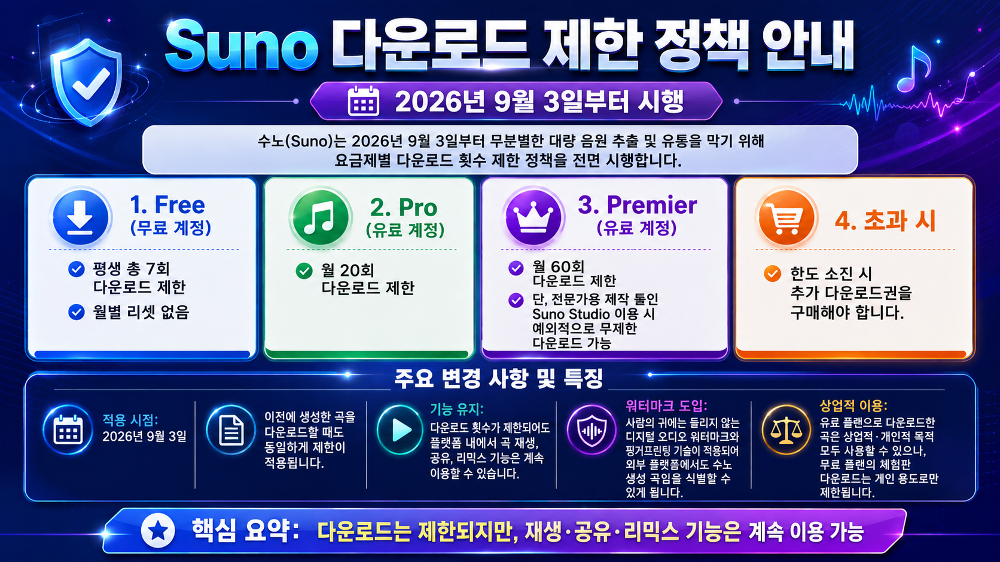

# Suno Backup Studio

Suno에 만들어 둔 **본인 음악을 Windows PC에 한꺼번에 보관하는 프로그램**입니다. 로그인된 계정의 Workspace를 자동으로 찾아 같은 곡은 한 번만 저장하며, 중간에 멈춰도 다음 실행에서 이어받습니다.

- MP3만, WAV만, MP3 + WAV 중 선택
- 가사, 프롬프트/스타일, 곡 메타데이터 함께 저장
- 활성 및 보관 Workspace 자동 검색
- Suno 곡 ID 기준 중복 제거
- 이미 받은 정상 파일은 건너뛰고 누락 파일만 재시도
- 로그인, 설정, 진행 기록을 한 화면에서 관리

> 이 프로젝트는 Suno의 공식 프로그램이 아닙니다. 본인이 만들었거나 다운로드할 권한이 있는 곡에만 사용하고 Suno의 이용 약관과 정책을 지켜 주세요.

## 컴퓨터 초보자용: 가장 쉬운 설치 방법

PowerShell, 명령 프롬프트, Node.js를 설치할 필요가 없습니다. 아래 순서대로 설치형 프로그램을 사용하세요.

### 1. 설치 파일 받기

1. [최신 버전 다운로드 페이지](https://github.com/rubyonsoft/sunofile/releases/latest)를 엽니다.
2. 아래쪽 **Assets**를 누릅니다. 이미 파일 목록이 보이면 그대로 진행합니다.
3. `Suno-Backup-Studio-Setup-3.0.4-x64.exe`를 누릅니다.
4. 다운로드가 끝나면 Windows의 **다운로드** 폴더를 엽니다.

`Portable`이라고 적힌 파일은 설치하지 않고 바로 실행하는 버전입니다. 처음 사용하는 분은 `Setup` 파일을 권장합니다.

### 2. 프로그램 설치하기

1. 받은 `Suno-Backup-Studio-Setup-3.0.4-x64.exe`를 두 번 클릭합니다.
2. Windows가 허용 여부를 물으면 파일 이름과 게시 위치가 이 GitHub 저장소인지 확인합니다.
3. **설치 위치 선택** 화면이 나오면 잘 모르겠을 때는 기본 위치를 그대로 사용합니다.
4. **설치**를 누르고 완료될 때까지 기다립니다.
5. 바탕 화면이나 시작 메뉴의 **Suno Backup Studio**를 엽니다.

현재 배포 파일에는 유료 코드 서명이 적용되지 않아 Windows에서 **Windows의 PC 보호** 또는 **알 수 없는 게시자** 경고가 보일 수 있습니다. 반드시 이 저장소의 Releases 페이지에서 직접 받은 파일인지 확인하세요. 출처가 다르면 실행하지 마세요.

### 3. Suno 로그인하기

Google Chrome이 없다면 먼저 [Google Chrome](https://www.google.com/chrome/)을 설치하세요.

1. 프로그램에서 **1. Suno 로그인**을 누릅니다.
2. Suno 첫 화면이 열린 별도의 Chrome 창에서 본인의 Suno 계정에 로그인합니다.
3. 오른쪽 위에 본인의 프로필 아이콘이나 계정 이름이 보이는지 확인합니다.
4. 방금 열린 **전용 Chrome 창을 완전히 닫습니다**.
5. Suno Backup Studio 화면으로 돌아옵니다. Workspace 화면은 곡 목록 확인이나 백업을 시작할 때 프로그램이 자동으로 엽니다.

Google 로그인 화면에 `브라우저 또는 앱이 안전하지 않을 수 있습니다`가 보이면 백업 자동화 창에서 로그인을 시도하지 마세요. 프로그램의 **1. Suno 로그인** 버튼이 연 일반 Chrome 창에서 로그인해야 합니다.

로그인 정보는 이 앱 전용 데이터 폴더에만 저장됩니다. Suno 비밀번호를 이 프로그램이나 다른 사람에게 보내지 마세요.

### 4. 음악 파일 형식 선택하기

첫 화면의 **음악 파일** 목록에서 하나를 선택합니다.

- `MP3 + WAV`: 두 형식을 모두 저장
- `MP3만`: 용량을 줄이고 일반 재생용 파일만 저장
- `WAV만`: 고음질 WAV만 저장

어떤 형식을 선택해도 가사, 프롬프트/스타일, 메타데이터는 함께 저장됩니다. WAV 다운로드는 해당 기능을 제공하는 Suno 구독이 필요할 수 있습니다.

### 5. 먼저 한 곡만 시험하기

처음에는 오른쪽 **시험 곡 수** 칸에 `1`을 입력한 뒤 **전체 백업 시작**을 누르는 것을 권장합니다.

1. 자동으로 열린 Chrome 창을 닫지 않습니다.
2. 작업 기록에 가사, 프롬프트, MP3 또는 WAV 저장 완료가 표시되는지 확인합니다.
3. **저장 폴더 열기**를 눌러 파일을 확인합니다.
4. 정상이라면 시험 곡 수의 `1`을 지우고 **전체 백업 시작**을 다시 누릅니다.

프로그램은 로그인된 계정의 `https://suno.com/me/workspaces`에서 Workspace 주소를 자동으로 찾습니다. 개인 Workspace 주소나 `config.json`을 직접 입력할 필요가 없습니다.

### 6. 받은 파일 확인하기

기본 저장 위치는 Windows의 **음악** 폴더 안에 있는 `Suno Backup` 폴더입니다. 프로그램의 **저장 폴더 열기** 버튼으로 바로 열 수 있습니다.

```text
Suno Backup/
├─ account-download-history.json
└─ 작곡용/
   ├─ 001 - 달빛 아래 너를 그려.wav
   ├─ 001 - 달빛 아래 너를 그려.mp3
   ├─ 001 - 달빛 아래 너를 그려 - lyrics.txt
   ├─ 001 - 달빛 아래 너를 그려 - prompt.txt
   └─ 001 - 달빛 아래 너를 그려 - metadata.json
```

`account-download-history.json`은 중복 제거와 이어받기에 필요하므로 특별한 이유가 없다면 삭제하지 마세요.

## 중단하고 다시 시작하기

백업을 멈추려면 앱의 **안전하게 중지**를 누릅니다. 현재 파일 처리가 끝난 뒤 기록을 저장하고 멈춥니다. 앱을 바로 닫으려고 해도 안전한 중지 여부를 먼저 묻습니다.

나중에 같은 형식으로 **전체 백업 시작**을 다시 누르면 다음 항목을 확인합니다.

- 선택한 형식의 정상 WAV 또는 MP3 파일
- 비어 있지 않은 가사 파일
- 비어 있지 않은 프롬프트/스타일 파일
- 곡 메타데이터 파일

정상 파일은 다시 받지 않고 빠졌거나 손상된 파일만 보충합니다. 나중에 다른 음악 형식을 선택하면 기존 파일은 유지하고 새로 선택한 형식 중 빠진 파일만 추가합니다.

## 설정 화면

초보자는 기본값을 그대로 사용해도 됩니다.

- **백업 저장 폴더**: 음악과 부가 정보를 저장할 위치
- **보관된 Workspace 포함**: 활성 Workspace와 보관 Workspace를 모두 검색
- **곡 사이 대기 시간**: 너무 빠른 요청을 피하기 위한 대기 시간
- **곡별 재시도 횟수**: 한 곡이 실패했을 때 다시 시도하는 횟수
- **Chrome 복구 횟수**: 자동화 Chrome이 닫혔을 때 복구하는 횟수

요청 간격을 너무 짧게 줄이면 Suno 서비스에 부담을 줄 수 있으므로 기본값을 권장합니다.

## 자주 발생하는 문제

### Google Chrome을 찾지 못합니다

[Google Chrome](https://www.google.com/chrome/)을 설치한 뒤 앱을 다시 실행하세요.

### Workspace 목록을 찾지 못합니다

1. 자동화로 열린 Chrome 창을 모두 닫습니다.
2. 앱의 **1. Suno 로그인**을 다시 누릅니다.
3. Suno 첫 화면에서 로그인된 계정의 프로필 아이콘이나 계정 이름을 확인합니다.
4. 전용 Chrome 창을 완전히 닫습니다.
5. **곡 목록 확인** 또는 **전체 백업 시작**을 다시 누릅니다. 프로그램이 `https://suno.com/me/workspaces`를 자동으로 엽니다.

### MP3는 받았는데 WAV가 실패합니다

Suno 사이트에서 해당 곡을 직접 WAV로 다운로드할 수 있는 계정인지 확인하세요. WAV 준비가 오래 걸리거나 일시적인 서버 문제라면 나중에 앱을 다시 실행했을 때 이어서 성공할 수 있습니다.

### 일부 곡만 실패합니다

인터넷이나 Suno 서버 상태 때문에 일시적으로 실패할 수 있습니다. 앱을 다시 실행하면 누락 파일을 재시도합니다. 진단 화면과 오류 정보는 앱 전용 데이터 폴더의 `logs`에 저장됩니다.

### 앱을 새 버전으로 업데이트하고 싶습니다

최신 `Setup` 파일을 Releases 페이지에서 받아 다시 설치하세요. 기본 음악 저장 폴더와 앱 전용 로그인/설정 데이터는 업데이트 후에도 유지됩니다. 중요한 음악은 별도 디스크에도 복사해 두는 것을 권장합니다.

## Suno 다운로드 제한 정책 참고



> 위 이미지는 참고 자료입니다. 시행일과 요금제별 횟수는 Suno 사정에 따라 변경될 수 있으므로 [Suno 공식 도움말](https://help.suno.com/)과 본인 계정의 구독 화면에서 다시 확인하세요.

## 개인정보와 음악 파일 보호

다음 데이터는 앱 설치 파일이나 GitHub 저장소에 포함되지 않습니다.

- Suno 로그인 세션
- 사용자의 `config.json`
- 내려받은 WAV, MP3, 가사, 프롬프트, 메타데이터
- 다운로드 이력과 오류 진단 화면

앱 데이터나 음악 폴더 전체를 다른 사람에게 보내지 마세요. 다른 사람에게 프로그램을 알려 줄 때는 이 GitHub 주소만 공유하세요.

## 소스 코드로 실행하기

아래 내용은 개발자 또는 기존 명령줄 버전을 사용하려는 분을 위한 것입니다. 일반 사용자는 위의 설치형 프로그램을 사용하면 됩니다.

필요한 프로그램:

- Windows 10 또는 11
- Google Chrome
- [Node.js](https://nodejs.org/) 20 이상
- Git 또는 GitHub의 **Download ZIP**으로 받은 소스 코드

```powershell
git clone https://github.com/rubyonsoft/sunofile.git
cd sunofile
Copy-Item config.example.json config.json
npm install
npm start
```

명령줄에서도 음악 형식을 선택할 수 있습니다.

```powershell
npm start -- --format mp3
npm start -- --format wav
npm start -- --format both
npm start -- --format both --limit 1
npm run scan
```

소스 코드 폴더에서 `.cmd` 파일을 두 번 클릭하는 기존 방식도 계속 지원합니다.

- `Suno_로그인_준비.cmd`: 로그인용 Chrome만 열기
- `Suno_전체_백업_실행.cmd`: MP3/WAV/둘 다 선택 후 전체 백업

데스크톱 앱을 개발 모드로 실행하거나 Windows 배포본을 빌드합니다.

```powershell
npm ci
npm test
npm run desktop
npm run dist:win
```

완성된 설치 파일과 Portable 파일은 `release` 폴더에 생성됩니다. 버전 태그를 GitHub에 올리면 `Build Windows App` 워크플로가 자동으로 Windows 앱을 빌드해 Releases에 첨부합니다.

## ChatGPT 또는 Codex에게 설치를 부탁하는 문장

사용자의 컴퓨터 파일과 터미널에 접근할 수 있는 ChatGPT 데스크톱 앱의 Codex 또는 Codex CLI라면 다음 문장으로 도움을 요청할 수 있습니다.

> Windows PC에 https://github.com/rubyonsoft/sunofile 의 최신 Setup 버전을 설치하고 실행해줘. README를 먼저 읽고 Chrome 설치 여부를 확인해줘. 로그인은 내가 직접 할 수 있게 알려주고, 기존 음악이나 로그인 데이터는 삭제하지 마. MP3, WAV 또는 둘 다 중 어떤 형식을 받을지 나에게 물어봐 줘.

로그인과 Windows 권한 확인은 사용자가 직접 승인해야 할 수 있습니다. ChatGPT나 다른 사람에게 Suno 비밀번호를 보내지 마세요.
